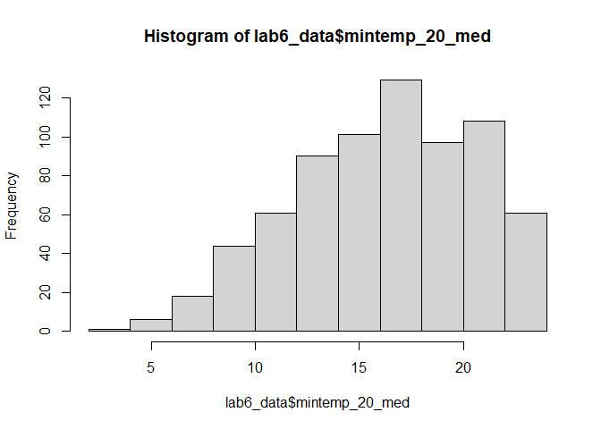
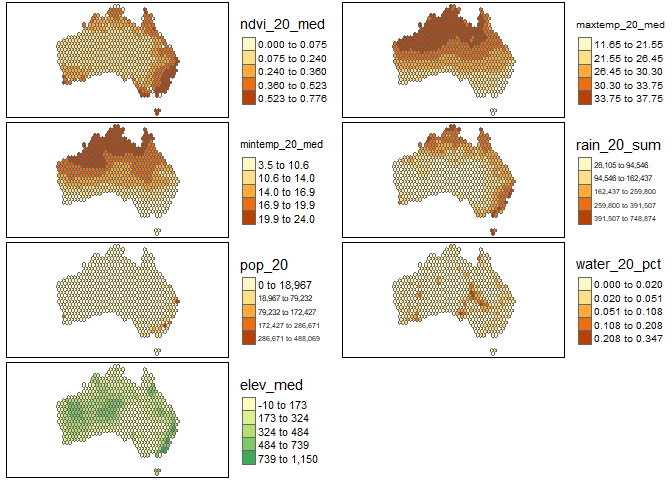
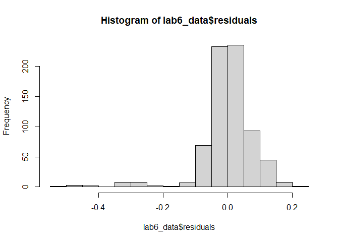
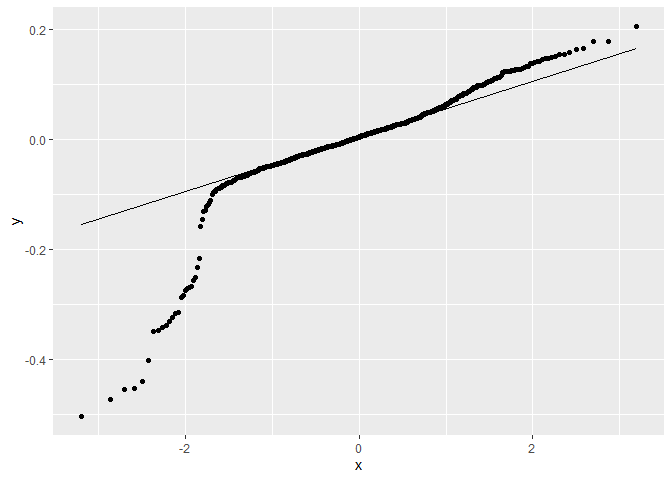
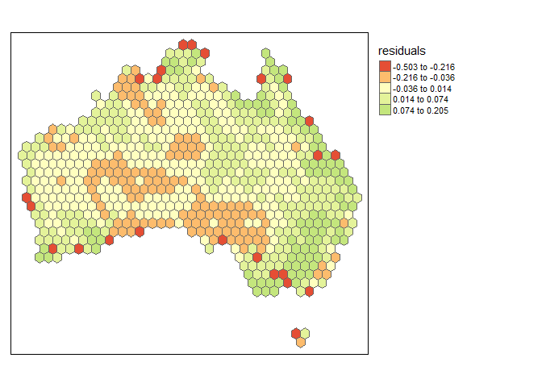

Geog6300: Lab 6
================

## Regression

``` r
library(sf)
library(tidyverse)
```

**Overview:** This lab focuses on regression techniques. You’ll be
analyzing the association of various physical and climatological
characteristics in Australia with observations of several animals
recorded on the citizen science app iNaturalist.

\###Data and research questions###

Let’s import the dataset.

``` r
lab6_data<-st_read("data/aus_climate_inat.gpkg")
```

    ## Reading layer `aus_climate_inat' from data source 
    ##   `C:\Users\jetoo\Desktop\data science\geog4-6300-lab-6-juliatootle-new\data\aus_climate_inat.gpkg' 
    ##   using driver `GPKG'
    ## Simple feature collection with 716 features and 22 fields
    ## Geometry type: POLYGON
    ## Dimension:     XY
    ## Bounding box:  xmin: 113.875 ymin: -43.38632 xmax: 153.375 ymax: -11.92074
    ## Geodetic CRS:  WGS 84 (CRS84)

The dataset for this lab is a 1 decimal degree hexagon grid that has
aggregate statistics for a number of variables:

- ndvi: NDVI/vegetation index values from Landsat data (via Google Earth
  Engine). These values range from -1 to 1, with higher values
  indicating more vegetation.
- maxtemp_00/20_med: Median maximum temperature (C) in 2000 or 2020
  (data from SILO/Queensland government)
- mintemp_00/20_med: Median minimum temperature (C) in 2020 or 2020
  (data from SILO/Queensland government)
- rain_00/20_sum: Total rainfall (mm) in 2000 or 2020 (data from
  SILO/Queensland government)
- pop_00/20: Total population in 2000 or 2020 (data from NASA’s Gridded
  Population of the World)
- water_00/20_pct: Percentage of land covered by water at some point
  during the year in 2000 or 2020
- elev_med: Median elevation (meters) (data from the Shuttle Radar
  Topography Mission/NASA)

There are also observation counts from iNaturalist for several
distinctively Australian animal species: the central bearded dragon, the
common emu, the red kangaroo, the agile wallaby, the laughing
kookaburra, the wombat, the koala, and the platypus.

Our primary research question is how the climatological/physical
variables in our dataset are predictive of the NDVI value. We will build
models for 2020 as well as the change from 2000 to 2020. The second is
referred to as a “first difference” model and can sometimes be more
useful for identifying causal mechanisms.

\###Part 1: Analysis of 2020 data###

We will start by looking at data for 2020.

**Question 1** *Create histograms for NDVI, max temp., min temp., rain,
and population, and water in 2020 as well as elevation. Based on these
graphs, assess the normality of these variables.*

``` r
hist(lab6_data$ndvi_20_med)
```

<!-- -->

``` r
hist(lab6_data$maxtemp_20_med)
```

<!-- -->

``` r
hist(lab6_data$mintemp_20_med)
```

<!-- -->

``` r
hist(lab6_data$rain_20_sum)
```

<!-- -->

``` r
hist(lab6_data$pop_20)
```

<!-- -->

``` r
hist(lab6_data$water_20_pct)
```

<!-- -->

``` r
hist(lab6_data$elev_med)
```

<!-- -->

{Looking at the shape of these histograms, it is reasonable to say that
none of these variables appear to be normally distributed. All the
graphs appeared skewed to some extent.}

**Question 2** *Use tmap to map these same variables using Jenks natural
breaks as the classification method. For an extra challenge, use
`tmap_arrange` to plot all maps in a single figure.*

``` r
library(tmap)
```

    ## Breaking News: tmap 3.x is retiring. Please test v4, e.g. with
    ## remotes::install_github('r-tmap/tmap')

``` r
veg_map <- tm_shape(lab6_data)+
  tm_polygons("ndvi_20_med", style="jenks")+
tm_legend(legend.outside=TRUE)

tmax_map <- tm_shape(lab6_data)+
  tm_polygons("maxtemp_20_med", style="jenks")+
tm_legend(legend.outside=TRUE)

tmin_map <- tm_shape(lab6_data)+
  tm_polygons("mintemp_20_med", style="jenks")+
tm_legend(legend.outside=TRUE)

rain_map <- tm_shape(lab6_data)+
  tm_polygons("rain_20_sum", style="jenks")+
tm_legend(legend.outside=TRUE)

pop_map <- tm_shape(lab6_data)+
  tm_polygons("pop_20", style="jenks")+
tm_legend(legend.outside=TRUE)

water_map <- tm_shape(lab6_data)+
  tm_polygons("water_20_pct", style="jenks")+
tm_legend(legend.outside=TRUE)

elev_map <- tm_shape(lab6_data)+
  tm_polygons("elev_med", style="jenks")+
tm_legend(legend.outside=TRUE)

tmap_arrange(veg_map, tmax_map, tmin_map, rain_map, pop_map, water_map, elev_map, ncol = 2)
```

    ## Legend labels were too wide. The labels have been resized to 0.6, 0.6, 0.6, 0.6, 0.6. Increase legend.width (argument of tm_layout) to make the legend wider and therefore the labels larger.

    ## Legend labels were too wide. The labels have been resized to 0.6, 0.6, 0.6, 0.6, 0.6. Increase legend.width (argument of tm_layout) to make the legend wider and therefore the labels larger.

    ## Legend labels were too wide. The labels have been resized to 0.51, 0.48, 0.45, 0.45, 0.45. Increase legend.width (argument of tm_layout) to make the legend wider and therefore the labels larger.

    ## Some legend labels were too wide. These labels have been resized to 0.51, 0.48, 0.45, 0.45. Increase legend.width (argument of tm_layout) to make the legend wider and therefore the labels larger.

    ## Legend labels were too wide. The labels have been resized to 0.6, 0.6, 0.6, 0.6, 0.6. Increase legend.width (argument of tm_layout) to make the legend wider and therefore the labels larger.

    ## Variable(s) "elev_med" contains positive and negative values, so midpoint is set to 0. Set midpoint = NA to show the full spectrum of the color palette.

<!-- -->

**Question 3** *Based on the maps from question 3, summarise major
patterns you see in the spatial distribution of these data from any of
your variables of interest. How do they appear to be associated with the
NDVI variable?*

{NVDI: tends to be higher along coastal regions, with the highest values
on the eastern coast. Max temp: gets higher as you go north, with a
slight lean in directionality towards the west. Min temp: same as max
temp; gets higher as you go north, with a slight lean in directionality
towards the west. Rain: increases as you go toward the coast,
particularly seen in the eastern and northern sectors. population:
relatively consistent value throughout, with a few outlier points (most
of which are located in the southeast). These are likely the major
cities water: not a clear pattern, but generally has higher values
within the middle of the eastern half. elevation: sectors which tend to
gradually rise to high elevation zones; highest zone seen along the
coast of the southeast, with other high elevation areas within the
middle of the western half.

NDVI tends to vary most closely with the rain variable, others partially
coincide spatially but there is not as clear of a visual trend. This
logically makes sense as increases in freshwater rain would allow for
more vegetation growth. It is also reasonable to postulate that
vegetation growth increases with decreasing temperature (tmax and tmin).
This trend is somewhat evident on the map, with the highest degrees of
vegetation being located on the southern coast.}

**Question 4** *Create univariate models for each of the variables
listed in question 1, with NDVI in 2020 as the dependent variable. Print
a summary of each model. Write a summary of those results that indicates
the direction, magnitude, and significance for each model coefficient.*

``` r
tmax_model <- lm(ndvi_20_med~maxtemp_20_med, data = lab6_data)
summary(tmax_model)
```

    ## 
    ## Call:
    ## lm(formula = ndvi_20_med ~ maxtemp_20_med, data = lab6_data)
    ## 
    ## Residuals:
    ##      Min       1Q   Median       3Q      Max 
    ## -0.41874 -0.07657 -0.01927  0.06833  0.36382 
    ## 
    ## Coefficients:
    ##                  Estimate Std. Error t value Pr(>|t|)    
    ## (Intercept)     0.6612389  0.0294372   22.46   <2e-16 ***
    ## maxtemp_20_med -0.0130902  0.0009601  -13.63   <2e-16 ***
    ## ---
    ## Signif. codes:  0 '***' 0.001 '**' 0.01 '*' 0.05 '.' 0.1 ' ' 1
    ## 
    ## Residual standard error: 0.1251 on 714 degrees of freedom
    ## Multiple R-squared:  0.2066, Adjusted R-squared:  0.2055 
    ## F-statistic: 185.9 on 1 and 714 DF,  p-value: < 2.2e-16

``` r
tmin_model <- lm(ndvi_20_med~mintemp_20_med, data = lab6_data)
summary(tmin_model)
```

    ## 
    ## Call:
    ## lm(formula = ndvi_20_med ~ mintemp_20_med, data = lab6_data)
    ## 
    ## Residuals:
    ##      Min       1Q   Median       3Q      Max 
    ## -0.36375 -0.08418 -0.03047  0.06972  0.40383 
    ## 
    ## Coefficients:
    ##                 Estimate Std. Error t value Pr(>|t|)    
    ## (Intercept)     0.464461   0.018997   24.45   <2e-16 ***
    ## mintemp_20_med -0.012282   0.001131  -10.86   <2e-16 ***
    ## ---
    ## Signif. codes:  0 '***' 0.001 '**' 0.01 '*' 0.05 '.' 0.1 ' ' 1
    ## 
    ## Residual standard error: 0.1301 on 714 degrees of freedom
    ## Multiple R-squared:  0.1418, Adjusted R-squared:  0.1406 
    ## F-statistic:   118 on 1 and 714 DF,  p-value: < 2.2e-16

``` r
rain_model <- lm(ndvi_20_med~rain_20_sum, data = lab6_data)
summary(rain_model)
```

    ## 
    ## Call:
    ## lm(formula = ndvi_20_med ~ rain_20_sum, data = lab6_data)
    ## 
    ## Residuals:
    ##      Min       1Q   Median       3Q      Max 
    ## -0.56681 -0.04753 -0.01210  0.04599  0.30930 
    ## 
    ## Coefficients:
    ##              Estimate Std. Error t value Pr(>|t|)    
    ## (Intercept) 1.303e-01  7.060e-03   18.45   <2e-16 ***
    ## rain_20_sum 9.124e-07  3.953e-08   23.08   <2e-16 ***
    ## ---
    ## Signif. codes:  0 '***' 0.001 '**' 0.01 '*' 0.05 '.' 0.1 ' ' 1
    ## 
    ## Residual standard error: 0.1063 on 714 degrees of freedom
    ## Multiple R-squared:  0.4273, Adjusted R-squared:  0.4265 
    ## F-statistic: 532.6 on 1 and 714 DF,  p-value: < 2.2e-16

``` r
pop_model <- lm(ndvi_20_med~pop_20, data = lab6_data)
summary(pop_model)
```

    ## 
    ## Call:
    ## lm(formula = ndvi_20_med ~ pop_20, data = lab6_data)
    ## 
    ## Residuals:
    ##      Min       1Q   Median       3Q      Max 
    ## -0.47003 -0.07883 -0.03949  0.06384  0.48974 
    ## 
    ## Coefficients:
    ##              Estimate Std. Error t value Pr(>|t|)    
    ## (Intercept) 2.552e-01  5.013e-03  50.902   <2e-16 ***
    ## pop_20      1.500e-06  1.500e-07   9.998   <2e-16 ***
    ## ---
    ## Signif. codes:  0 '***' 0.001 '**' 0.01 '*' 0.05 '.' 0.1 ' ' 1
    ## 
    ## Residual standard error: 0.1316 on 714 degrees of freedom
    ## Multiple R-squared:  0.1228, Adjusted R-squared:  0.1216 
    ## F-statistic: 99.97 on 1 and 714 DF,  p-value: < 2.2e-16

``` r
water_model <- lm(ndvi_20_med~water_20_pct, data = lab6_data)
summary(water_model)
```

    ## 
    ## Call:
    ## lm(formula = ndvi_20_med ~ water_20_pct, data = lab6_data)
    ## 
    ## Residuals:
    ##      Min       1Q   Median       3Q      Max 
    ## -0.26898 -0.08838 -0.04838  0.06871  0.50911 
    ## 
    ## Coefficients:
    ##               Estimate Std. Error t value Pr(>|t|)    
    ## (Intercept)   0.268988   0.006287  42.781   <2e-16 ***
    ## water_20_pct -0.178263   0.154480  -1.154    0.249    
    ## ---
    ## Signif. codes:  0 '***' 0.001 '**' 0.01 '*' 0.05 '.' 0.1 ' ' 1
    ## 
    ## Residual standard error: 0.1403 on 714 degrees of freedom
    ## Multiple R-squared:  0.001862,   Adjusted R-squared:  0.0004636 
    ## F-statistic: 1.332 on 1 and 714 DF,  p-value: 0.2489

``` r
elev_model <- lm(ndvi_20_med~elev_med, data = lab6_data)
summary(elev_model)
```

    ## 
    ## Call:
    ## lm(formula = ndvi_20_med ~ elev_med, data = lab6_data)
    ## 
    ## Residuals:
    ##      Min       1Q   Median       3Q      Max 
    ## -0.27082 -0.09585 -0.04270  0.07954  0.44272 
    ## 
    ## Coefficients:
    ##              Estimate Std. Error t value Pr(>|t|)    
    ## (Intercept) 2.138e-01  9.741e-03  21.952  < 2e-16 ***
    ## elev_med    1.787e-04  2.895e-05   6.171 1.14e-09 ***
    ## ---
    ## Signif. codes:  0 '***' 0.001 '**' 0.01 '*' 0.05 '.' 0.1 ' ' 1
    ## 
    ## Residual standard error: 0.1369 on 714 degrees of freedom
    ## Multiple R-squared:  0.05064,    Adjusted R-squared:  0.04931 
    ## F-statistic: 38.08 on 1 and 714 DF,  p-value: 1.136e-09

{Max temp: had a coefficient of -.013 (negative direction) with a three
star significance level, indicating that the results were very
significant. This indicates that for every degree increase in max
temperature, there was a .013 decrease in NVDI level (vegetation).

Min temp: had a coefficient of -.012 (negative direction), also with a
three star significance (99.9% significant). This indicates that for
every degree increase in min temperature, there was a .012 decrease in
NVDI level.

Rain: had a coefficient of 9.234e-07 (positive direction) with three
star significance (99.9%). This means for every 1 mm increase of rain,
there is a 9.234e-07 increase in NVDI level.

Pop: had a coefficient of 1.500e-06 (positive direction) with a three
star significance level. This indicates for every 1 unit increase in
population, there is a 1.500e-06 increase in the NVDI level.

Water: had a coefficient of -.17 (negative direction) with a p-value of
.249, meaning that the results between these two variables is not
statistically significant. This coefficient would indicate that for
every 1 percent increase in land covered by water, there is a .17
decrease in NVDI level.

Elevation: had a coefficient of 1.787e-04 (positive direction) with
three star significance (99.9%). This indicates that for every 1 meter
increase in elevation, there was a 1.787e-04 increase in NVDI level.}

**Question 5** *Create a multivariate regression model with the
variables of interest, choosing EITHER max or min temperature (but not
both) You may also choose to leave out any variables that were
insignificant in Q4. Use the univariate models as your guide. Call the
results.*

``` r
model_all<-lm(ndvi_20_med~maxtemp_20_med+rain_20_sum+pop_20+water_20_pct+elev_med,data=lab6_data)

summary(model_all)
```

    ## 
    ## Call:
    ## lm(formula = ndvi_20_med ~ maxtemp_20_med + rain_20_sum + pop_20 + 
    ##     water_20_pct + elev_med, data = lab6_data)
    ## 
    ## Residuals:
    ##      Min       1Q   Median       3Q      Max 
    ## -0.50306 -0.02849  0.00444  0.03912  0.20545 
    ## 
    ## Coefficients:
    ##                  Estimate Std. Error t value Pr(>|t|)    
    ## (Intercept)     4.591e-01  2.272e-02  20.206  < 2e-16 ***
    ## maxtemp_20_med -1.173e-02  6.834e-04 -17.160  < 2e-16 ***
    ## rain_20_sum     8.464e-07  3.269e-08  25.887  < 2e-16 ***
    ## pop_20          2.873e-07  1.045e-07   2.749  0.00613 ** 
    ## water_20_pct   -3.387e-02  9.717e-02  -0.349  0.72750    
    ## elev_med        1.215e-04  1.862e-05   6.526 1.28e-10 ***
    ## ---
    ## Signif. codes:  0 '***' 0.001 '**' 0.01 '*' 0.05 '.' 0.1 ' ' 1
    ## 
    ## Residual standard error: 0.08455 on 710 degrees of freedom
    ## Multiple R-squared:  0.6397, Adjusted R-squared:  0.6372 
    ## F-statistic: 252.1 on 5 and 710 DF,  p-value: < 2.2e-16

``` r
library(sjPlot)
tab_model(tmax_model, rain_model, pop_model, water_model, elev_model, model_all)
```

<table style="border-collapse:collapse; border:none;">
<tr>
<th style="border-top: double; text-align:center; font-style:normal; font-weight:bold; padding:0.2cm;  text-align:left; ">
 
</th>
<th colspan="3" style="border-top: double; text-align:center; font-style:normal; font-weight:bold; padding:0.2cm; ">
Dependent variable
</th>
<th colspan="3" style="border-top: double; text-align:center; font-style:normal; font-weight:bold; padding:0.2cm; ">
Dependent variable
</th>
<th colspan="3" style="border-top: double; text-align:center; font-style:normal; font-weight:bold; padding:0.2cm; ">
Dependent variable
</th>
<th colspan="3" style="border-top: double; text-align:center; font-style:normal; font-weight:bold; padding:0.2cm; ">
Dependent variable
</th>
<th colspan="3" style="border-top: double; text-align:center; font-style:normal; font-weight:bold; padding:0.2cm; ">
Dependent variable
</th>
<th colspan="3" style="border-top: double; text-align:center; font-style:normal; font-weight:bold; padding:0.2cm; ">
Dependent variable
</th>
</tr>
<tr>
<td style=" text-align:center; border-bottom:1px solid; font-style:italic; font-weight:normal;  text-align:left; ">
Predictors
</td>
<td style=" text-align:center; border-bottom:1px solid; font-style:italic; font-weight:normal;  ">
Estimates
</td>
<td style=" text-align:center; border-bottom:1px solid; font-style:italic; font-weight:normal;  ">
CI
</td>
<td style=" text-align:center; border-bottom:1px solid; font-style:italic; font-weight:normal;  ">
p
</td>
<td style=" text-align:center; border-bottom:1px solid; font-style:italic; font-weight:normal;  ">
Estimates
</td>
<td style=" text-align:center; border-bottom:1px solid; font-style:italic; font-weight:normal;  ">
CI
</td>
<td style=" text-align:center; border-bottom:1px solid; font-style:italic; font-weight:normal;  col7">
p
</td>
<td style=" text-align:center; border-bottom:1px solid; font-style:italic; font-weight:normal;  col8">
Estimates
</td>
<td style=" text-align:center; border-bottom:1px solid; font-style:italic; font-weight:normal;  col9">
CI
</td>
<td style=" text-align:center; border-bottom:1px solid; font-style:italic; font-weight:normal;  0">
p
</td>
<td style=" text-align:center; border-bottom:1px solid; font-style:italic; font-weight:normal;  1">
Estimates
</td>
<td style=" text-align:center; border-bottom:1px solid; font-style:italic; font-weight:normal;  2">
CI
</td>
<td style=" text-align:center; border-bottom:1px solid; font-style:italic; font-weight:normal;  3">
p
</td>
<td style=" text-align:center; border-bottom:1px solid; font-style:italic; font-weight:normal;  4">
Estimates
</td>
<td style=" text-align:center; border-bottom:1px solid; font-style:italic; font-weight:normal;  5">
CI
</td>
<td style=" text-align:center; border-bottom:1px solid; font-style:italic; font-weight:normal;  6">
p
</td>
<td style=" text-align:center; border-bottom:1px solid; font-style:italic; font-weight:normal;  7">
Estimates
</td>
<td style=" text-align:center; border-bottom:1px solid; font-style:italic; font-weight:normal;  8">
CI
</td>
<td style=" text-align:center; border-bottom:1px solid; font-style:italic; font-weight:normal;  9">
p
</td>
</tr>
<tr>
<td style=" padding:0.2cm; text-align:left; vertical-align:top; text-align:left; ">
(Intercept)
</td>
<td style=" padding:0.2cm; text-align:left; vertical-align:top; text-align:center;  ">
0.66
</td>
<td style=" padding:0.2cm; text-align:left; vertical-align:top; text-align:center;  ">
0.60 – 0.72
</td>
<td style=" padding:0.2cm; text-align:left; vertical-align:top; text-align:center;  ">
<strong>\<0.001</strong>
</td>
<td style=" padding:0.2cm; text-align:left; vertical-align:top; text-align:center;  ">
0.13
</td>
<td style=" padding:0.2cm; text-align:left; vertical-align:top; text-align:center;  ">
0.12 – 0.14
</td>
<td style=" padding:0.2cm; text-align:left; vertical-align:top; text-align:center;  col7">
<strong>\<0.001</strong>
</td>
<td style=" padding:0.2cm; text-align:left; vertical-align:top; text-align:center;  col8">
0.26
</td>
<td style=" padding:0.2cm; text-align:left; vertical-align:top; text-align:center;  col9">
0.25 – 0.27
</td>
<td style=" padding:0.2cm; text-align:left; vertical-align:top; text-align:center;  0">
<strong>\<0.001</strong>
</td>
<td style=" padding:0.2cm; text-align:left; vertical-align:top; text-align:center;  1">
0.27
</td>
<td style=" padding:0.2cm; text-align:left; vertical-align:top; text-align:center;  2">
0.26 – 0.28
</td>
<td style=" padding:0.2cm; text-align:left; vertical-align:top; text-align:center;  3">
<strong>\<0.001</strong>
</td>
<td style=" padding:0.2cm; text-align:left; vertical-align:top; text-align:center;  4">
0.21
</td>
<td style=" padding:0.2cm; text-align:left; vertical-align:top; text-align:center;  5">
0.19 – 0.23
</td>
<td style=" padding:0.2cm; text-align:left; vertical-align:top; text-align:center;  6">
<strong>\<0.001</strong>
</td>
<td style=" padding:0.2cm; text-align:left; vertical-align:top; text-align:center;  7">
0.46
</td>
<td style=" padding:0.2cm; text-align:left; vertical-align:top; text-align:center;  8">
0.41 – 0.50
</td>
<td style=" padding:0.2cm; text-align:left; vertical-align:top; text-align:center;  9">
<strong>\<0.001</strong>
</td>
</tr>
<tr>
<td style=" padding:0.2cm; text-align:left; vertical-align:top; text-align:left; ">
maxtemp 20 med
</td>
<td style=" padding:0.2cm; text-align:left; vertical-align:top; text-align:center;  ">
-0.01
</td>
<td style=" padding:0.2cm; text-align:left; vertical-align:top; text-align:center;  ">
-0.01 – -0.01
</td>
<td style=" padding:0.2cm; text-align:left; vertical-align:top; text-align:center;  ">
<strong>\<0.001</strong>
</td>
<td style=" padding:0.2cm; text-align:left; vertical-align:top; text-align:center;  ">
</td>
<td style=" padding:0.2cm; text-align:left; vertical-align:top; text-align:center;  ">
</td>
<td style=" padding:0.2cm; text-align:left; vertical-align:top; text-align:center;  col7">
</td>
<td style=" padding:0.2cm; text-align:left; vertical-align:top; text-align:center;  col8">
</td>
<td style=" padding:0.2cm; text-align:left; vertical-align:top; text-align:center;  col9">
</td>
<td style=" padding:0.2cm; text-align:left; vertical-align:top; text-align:center;  0">
</td>
<td style=" padding:0.2cm; text-align:left; vertical-align:top; text-align:center;  1">
</td>
<td style=" padding:0.2cm; text-align:left; vertical-align:top; text-align:center;  2">
</td>
<td style=" padding:0.2cm; text-align:left; vertical-align:top; text-align:center;  3">
</td>
<td style=" padding:0.2cm; text-align:left; vertical-align:top; text-align:center;  4">
</td>
<td style=" padding:0.2cm; text-align:left; vertical-align:top; text-align:center;  5">
</td>
<td style=" padding:0.2cm; text-align:left; vertical-align:top; text-align:center;  6">
</td>
<td style=" padding:0.2cm; text-align:left; vertical-align:top; text-align:center;  7">
-0.01
</td>
<td style=" padding:0.2cm; text-align:left; vertical-align:top; text-align:center;  8">
-0.01 – -0.01
</td>
<td style=" padding:0.2cm; text-align:left; vertical-align:top; text-align:center;  9">
<strong>\<0.001</strong>
</td>
</tr>
<tr>
<td style=" padding:0.2cm; text-align:left; vertical-align:top; text-align:left; ">
rain 20 sum
</td>
<td style=" padding:0.2cm; text-align:left; vertical-align:top; text-align:center;  ">
</td>
<td style=" padding:0.2cm; text-align:left; vertical-align:top; text-align:center;  ">
</td>
<td style=" padding:0.2cm; text-align:left; vertical-align:top; text-align:center;  ">
</td>
<td style=" padding:0.2cm; text-align:left; vertical-align:top; text-align:center;  ">
0.00
</td>
<td style=" padding:0.2cm; text-align:left; vertical-align:top; text-align:center;  ">
0.00 – 0.00
</td>
<td style=" padding:0.2cm; text-align:left; vertical-align:top; text-align:center;  col7">
<strong>\<0.001</strong>
</td>
<td style=" padding:0.2cm; text-align:left; vertical-align:top; text-align:center;  col8">
</td>
<td style=" padding:0.2cm; text-align:left; vertical-align:top; text-align:center;  col9">
</td>
<td style=" padding:0.2cm; text-align:left; vertical-align:top; text-align:center;  0">
</td>
<td style=" padding:0.2cm; text-align:left; vertical-align:top; text-align:center;  1">
</td>
<td style=" padding:0.2cm; text-align:left; vertical-align:top; text-align:center;  2">
</td>
<td style=" padding:0.2cm; text-align:left; vertical-align:top; text-align:center;  3">
</td>
<td style=" padding:0.2cm; text-align:left; vertical-align:top; text-align:center;  4">
</td>
<td style=" padding:0.2cm; text-align:left; vertical-align:top; text-align:center;  5">
</td>
<td style=" padding:0.2cm; text-align:left; vertical-align:top; text-align:center;  6">
</td>
<td style=" padding:0.2cm; text-align:left; vertical-align:top; text-align:center;  7">
0.00
</td>
<td style=" padding:0.2cm; text-align:left; vertical-align:top; text-align:center;  8">
0.00 – 0.00
</td>
<td style=" padding:0.2cm; text-align:left; vertical-align:top; text-align:center;  9">
<strong>\<0.001</strong>
</td>
</tr>
<tr>
<td style=" padding:0.2cm; text-align:left; vertical-align:top; text-align:left; ">
pop 20
</td>
<td style=" padding:0.2cm; text-align:left; vertical-align:top; text-align:center;  ">
</td>
<td style=" padding:0.2cm; text-align:left; vertical-align:top; text-align:center;  ">
</td>
<td style=" padding:0.2cm; text-align:left; vertical-align:top; text-align:center;  ">
</td>
<td style=" padding:0.2cm; text-align:left; vertical-align:top; text-align:center;  ">
</td>
<td style=" padding:0.2cm; text-align:left; vertical-align:top; text-align:center;  ">
</td>
<td style=" padding:0.2cm; text-align:left; vertical-align:top; text-align:center;  col7">
</td>
<td style=" padding:0.2cm; text-align:left; vertical-align:top; text-align:center;  col8">
0.00
</td>
<td style=" padding:0.2cm; text-align:left; vertical-align:top; text-align:center;  col9">
0.00 – 0.00
</td>
<td style=" padding:0.2cm; text-align:left; vertical-align:top; text-align:center;  0">
<strong>\<0.001</strong>
</td>
<td style=" padding:0.2cm; text-align:left; vertical-align:top; text-align:center;  1">
</td>
<td style=" padding:0.2cm; text-align:left; vertical-align:top; text-align:center;  2">
</td>
<td style=" padding:0.2cm; text-align:left; vertical-align:top; text-align:center;  3">
</td>
<td style=" padding:0.2cm; text-align:left; vertical-align:top; text-align:center;  4">
</td>
<td style=" padding:0.2cm; text-align:left; vertical-align:top; text-align:center;  5">
</td>
<td style=" padding:0.2cm; text-align:left; vertical-align:top; text-align:center;  6">
</td>
<td style=" padding:0.2cm; text-align:left; vertical-align:top; text-align:center;  7">
0.00
</td>
<td style=" padding:0.2cm; text-align:left; vertical-align:top; text-align:center;  8">
0.00 – 0.00
</td>
<td style=" padding:0.2cm; text-align:left; vertical-align:top; text-align:center;  9">
<strong>0.006</strong>
</td>
</tr>
<tr>
<td style=" padding:0.2cm; text-align:left; vertical-align:top; text-align:left; ">
water 20 pct
</td>
<td style=" padding:0.2cm; text-align:left; vertical-align:top; text-align:center;  ">
</td>
<td style=" padding:0.2cm; text-align:left; vertical-align:top; text-align:center;  ">
</td>
<td style=" padding:0.2cm; text-align:left; vertical-align:top; text-align:center;  ">
</td>
<td style=" padding:0.2cm; text-align:left; vertical-align:top; text-align:center;  ">
</td>
<td style=" padding:0.2cm; text-align:left; vertical-align:top; text-align:center;  ">
</td>
<td style=" padding:0.2cm; text-align:left; vertical-align:top; text-align:center;  col7">
</td>
<td style=" padding:0.2cm; text-align:left; vertical-align:top; text-align:center;  col8">
</td>
<td style=" padding:0.2cm; text-align:left; vertical-align:top; text-align:center;  col9">
</td>
<td style=" padding:0.2cm; text-align:left; vertical-align:top; text-align:center;  0">
</td>
<td style=" padding:0.2cm; text-align:left; vertical-align:top; text-align:center;  1">
-0.18
</td>
<td style=" padding:0.2cm; text-align:left; vertical-align:top; text-align:center;  2">
-0.48 – 0.13
</td>
<td style=" padding:0.2cm; text-align:left; vertical-align:top; text-align:center;  3">
0.249
</td>
<td style=" padding:0.2cm; text-align:left; vertical-align:top; text-align:center;  4">
</td>
<td style=" padding:0.2cm; text-align:left; vertical-align:top; text-align:center;  5">
</td>
<td style=" padding:0.2cm; text-align:left; vertical-align:top; text-align:center;  6">
</td>
<td style=" padding:0.2cm; text-align:left; vertical-align:top; text-align:center;  7">
-0.03
</td>
<td style=" padding:0.2cm; text-align:left; vertical-align:top; text-align:center;  8">
-0.22 – 0.16
</td>
<td style=" padding:0.2cm; text-align:left; vertical-align:top; text-align:center;  9">
0.728
</td>
</tr>
<tr>
<td style=" padding:0.2cm; text-align:left; vertical-align:top; text-align:left; ">
elev med
</td>
<td style=" padding:0.2cm; text-align:left; vertical-align:top; text-align:center;  ">
</td>
<td style=" padding:0.2cm; text-align:left; vertical-align:top; text-align:center;  ">
</td>
<td style=" padding:0.2cm; text-align:left; vertical-align:top; text-align:center;  ">
</td>
<td style=" padding:0.2cm; text-align:left; vertical-align:top; text-align:center;  ">
</td>
<td style=" padding:0.2cm; text-align:left; vertical-align:top; text-align:center;  ">
</td>
<td style=" padding:0.2cm; text-align:left; vertical-align:top; text-align:center;  col7">
</td>
<td style=" padding:0.2cm; text-align:left; vertical-align:top; text-align:center;  col8">
</td>
<td style=" padding:0.2cm; text-align:left; vertical-align:top; text-align:center;  col9">
</td>
<td style=" padding:0.2cm; text-align:left; vertical-align:top; text-align:center;  0">
</td>
<td style=" padding:0.2cm; text-align:left; vertical-align:top; text-align:center;  1">
</td>
<td style=" padding:0.2cm; text-align:left; vertical-align:top; text-align:center;  2">
</td>
<td style=" padding:0.2cm; text-align:left; vertical-align:top; text-align:center;  3">
</td>
<td style=" padding:0.2cm; text-align:left; vertical-align:top; text-align:center;  4">
0.00
</td>
<td style=" padding:0.2cm; text-align:left; vertical-align:top; text-align:center;  5">
0.00 – 0.00
</td>
<td style=" padding:0.2cm; text-align:left; vertical-align:top; text-align:center;  6">
<strong>\<0.001</strong>
</td>
<td style=" padding:0.2cm; text-align:left; vertical-align:top; text-align:center;  7">
0.00
</td>
<td style=" padding:0.2cm; text-align:left; vertical-align:top; text-align:center;  8">
0.00 – 0.00
</td>
<td style=" padding:0.2cm; text-align:left; vertical-align:top; text-align:center;  9">
<strong>\<0.001</strong>
</td>
</tr>
<tr>
<td style=" padding:0.2cm; text-align:left; vertical-align:top; text-align:left; padding-top:0.1cm; padding-bottom:0.1cm; border-top:1px solid;">
Observations
</td>
<td style=" padding:0.2cm; text-align:left; vertical-align:top; padding-top:0.1cm; padding-bottom:0.1cm; text-align:left; border-top:1px solid;" colspan="3">
716
</td>
<td style=" padding:0.2cm; text-align:left; vertical-align:top; padding-top:0.1cm; padding-bottom:0.1cm; text-align:left; border-top:1px solid;" colspan="3">
716
</td>
<td style=" padding:0.2cm; text-align:left; vertical-align:top; padding-top:0.1cm; padding-bottom:0.1cm; text-align:left; border-top:1px solid;" colspan="3">
716
</td>
<td style=" padding:0.2cm; text-align:left; vertical-align:top; padding-top:0.1cm; padding-bottom:0.1cm; text-align:left; border-top:1px solid;" colspan="3">
716
</td>
<td style=" padding:0.2cm; text-align:left; vertical-align:top; padding-top:0.1cm; padding-bottom:0.1cm; text-align:left; border-top:1px solid;" colspan="3">
716
</td>
<td style=" padding:0.2cm; text-align:left; vertical-align:top; padding-top:0.1cm; padding-bottom:0.1cm; text-align:left; border-top:1px solid;" colspan="3">
716
</td>
</tr>
<tr>
<td style=" padding:0.2cm; text-align:left; vertical-align:top; text-align:left; padding-top:0.1cm; padding-bottom:0.1cm;">
R<sup>2</sup> / R<sup>2</sup> adjusted
</td>
<td style=" padding:0.2cm; text-align:left; vertical-align:top; padding-top:0.1cm; padding-bottom:0.1cm; text-align:left;" colspan="3">
0.207 / 0.205
</td>
<td style=" padding:0.2cm; text-align:left; vertical-align:top; padding-top:0.1cm; padding-bottom:0.1cm; text-align:left;" colspan="3">
0.427 / 0.426
</td>
<td style=" padding:0.2cm; text-align:left; vertical-align:top; padding-top:0.1cm; padding-bottom:0.1cm; text-align:left;" colspan="3">
0.123 / 0.122
</td>
<td style=" padding:0.2cm; text-align:left; vertical-align:top; padding-top:0.1cm; padding-bottom:0.1cm; text-align:left;" colspan="3">
0.002 / 0.000
</td>
<td style=" padding:0.2cm; text-align:left; vertical-align:top; padding-top:0.1cm; padding-bottom:0.1cm; text-align:left;" colspan="3">
0.051 / 0.049
</td>
<td style=" padding:0.2cm; text-align:left; vertical-align:top; padding-top:0.1cm; padding-bottom:0.1cm; text-align:left;" colspan="3">
0.640 / 0.637
</td>
</tr>
</table>

**Question 6** *Summarize the results of the multivariate model. What
are the direction, magnitude, and significance of each coefficient? How
did it change from the univariate models you created in Q4 (if at all)?
What do the R2 and F-statistic values tell you about overall model fit?*

{maxtemp: had a coefficient of -1.173e-02 (negative direction), this is
a very similar value to what was found in the previous univariate model
(-.01). They both also had p-values of \<.001, making them very
significant (99.9%).

rain: had a coefficient of 8.464e-07 (positive direction), this was also
very similar to the value in the previous model (9.234e-07, close to 0).
They both also had p-values of \<.001, making them very significant
(99.9%).

pop: had a coefficient of 2.873e-07 (positive direction), which was also
very similar to the previous model (1.500e-06, essentially ~0). However,
for this model there was a p-value of .006, which has 2 star
significance (99%). This is still statistically significant but less so
than the previous three star significance seen in the univariate model
(99.9%).

water: had a coefficient of -3.387e-02 (negative direction), this was
quite different from the previous model but was still in the negative
direction (-.03 vs -.18). Additionally, this variable also was not
considered significant (like in the previous model, receiving a p-value
of .728).

elevation: had a coefficient of 1.215e-04 (positive direction), which is
very similar to the previous model (1.787e-04). It also received a
p-value of \<.001 (99.9% significance).

R^2 and F-statistic: the R^2 value was .6397 which is quite good (a
large amount of variation in nvdi is explained by the other variables of
interest), and the F-statistic was 252.1 with a very small p-value
(meaning the results are significant). This means that we reject the
null hypothesis (that the predictors do not predict) and that there is
at least one predictor that is contributing to variation in the ndvi
variable.}

**Question 7** *Use a histogram and a map to assess the normality of
residuals and any spatial autocorrelation. Summarise any notable
patterns that you see.*

``` r
library(ggplot2)
lab6_data$residuals<-residuals(model_all)

hist(lab6_data$residuals)
```

<!-- -->

``` r
ggplot(lab6_data,aes(sample=residuals))+
  stat_qq()+stat_qq_line()
```

<!-- -->

``` r
shapiro.test(lab6_data$residuals)
```

    ## 
    ##  Shapiro-Wilk normality test
    ## 
    ## data:  lab6_data$residuals
    ## W = 0.81938, p-value < 2.2e-16

``` r
tm_shape(lab6_data)+
  tm_polygons("residuals", style="jenks")+
tm_legend(legend.outside=TRUE)
```

    ## Variable(s) "residuals" contains positive and negative values, so midpoint is set to 0. Set midpoint = NA to show the full spectrum of the color palette.

<!-- -->

{Based off the histogram, the abnormal qq plot, and the shapiro-wilk
test with a very small p-value (less than .05), we can determine that
the distribution of residuals is not normal. Looking at the map, we tend
to see the highest magnitude of residuals along the coast. This is
generally seen at the positive and negative ends of the residual
spectrum, though the negative residuals at the coastline have a greater
magnitude. Analyzing other subsets, smaller negative values tend to be
within the spatial middle of the continent, while smaller positive
values tend to be closer to the coast (but, this trend is not as well
defined).}

**Question 8** *Assess any issues with multicollinearity or
heteroskedastity in this model using the techniques shown in class. Run
the appropriate tests and explain what their results show you.*

``` r
library(car)
```

    ## Warning: package 'car' was built under R version 4.4.2

    ## Loading required package: carData

    ## Warning: package 'carData' was built under R version 4.4.2

    ## 
    ## Attaching package: 'car'

    ## The following object is masked from 'package:dplyr':
    ## 
    ##     recode

    ## The following object is masked from 'package:purrr':
    ## 
    ##     some

``` r
vif(model_all)
```

    ## maxtemp_20_med    rain_20_sum         pop_20   water_20_pct       elev_med 
    ##       1.109442       1.081126       1.174874       1.090059       1.084266

``` r
library(lmtest)
```

    ## Loading required package: zoo

    ## 
    ## Attaching package: 'zoo'

    ## The following objects are masked from 'package:base':
    ## 
    ##     as.Date, as.Date.numeric

``` r
bptest(model_all)
```

    ## 
    ##  studentized Breusch-Pagan test
    ## 
    ## data:  model_all
    ## BP = 122.09, df = 5, p-value < 2.2e-16

{VIF checks for multicollinarity. All the variables had vif values of
around 1. This is good as it indicates that there likely is no
correlation between variables.

BP checks for heteroskedastity. It got a BP of 122.09 with very small
p-value (less than .05). This indicates that we reject the null
hypothesis, and that the data is heteroskedastic (meaning that the
variables do not have constant variance).}

**Question 9** *How would you summarise the results of this model in a
sentence or two? In addition, looking at the full model and your
diagnostics, do you feel this is a model that provides meaningful
results? Explain your answer.*

This multivariate model produced statistically significant results for
most of its variables, with an overall R^2 of 63.97. Even though the
coefficients for many of the variables were quite small, this indicates
that the model had a strong overall fit and explained the general
variance of the NDVI variable over the continent of Australia. Looking
further at the models diagnostics, residuals were found to not be
normally distributed. Additionally, the model was found heterskedastic
by the BP test, but it did not have any multicollinarity issues (as
supported by the VIF test). Overall, though the model offers insights
into the relations between predictors, due to diagnostic issues
(particularly heteroskedasticity and non-normal residuals), I would say
that this is not necessarily the most meaningful model.

**Disclosure of assistance:** *Besides class materials, what other
sources of assistance did you use while completing this lab? These can
include input from classmates, relevant material identified through web
searches (e.g., Stack Overflow), or assistance from ChatGPT or other AI
tools. How did these sources support your own learning in completing
this lab?*

{I consulted friends and used ChatGPT if we were having
difficultites/errors. In simple terms, they elevate my learning or
answer small questions I have very quickly (in particular, this lab it
was very helpful in remembering what packages I needed to load for
specific functions).}

**Lab reflection:** *How do you feel about the work you did on this lab?
Was it easy, moderate, or hard? What were the biggest things you learned
by completing it?*

{I thought this lab was moderate. It was a nice review of our previous
lab at the beginning and allowed us to incorporate that knowledge into
doing the regression models. The biggest thing I learned was how to
format and use regression models in this coding program. These types of
statistical methodologies are very common in the type of research I do,
so it was very helpful to learn some coding aspects of it.}

**Challenge question**

\#Option 1 Create a first difference model. To do that, subtract the
values in 2000 from the values in 2020 for each variable for which that
is appropriate. Then create a new model similar to the one you created
in question 5, but using these new variables showing the *change in
values* over time. Call the results of the model, and interpret the
results in the same ways you did above. Also chart and map the residuals
to assess model error. Finally, write a short section that summarises
what, if anything, this model tells you.

\#Option 2 The animal data included in this dataset is an example of
count data, and usually we would use a Poisson or similar model for that
purpose. Let’s try it with regular OLS regression though. Create two
regression models to assess how the counts of two different animals
(say, koalas and emus) are associated with at least three of the
environmental/climatological variables given above. Be sure to use the
same independent variables in each model. Interpret the results of each
model and then explain the importance of any differences in the model
coefficients between them, focusing on direction, magnitude, and
significance.
